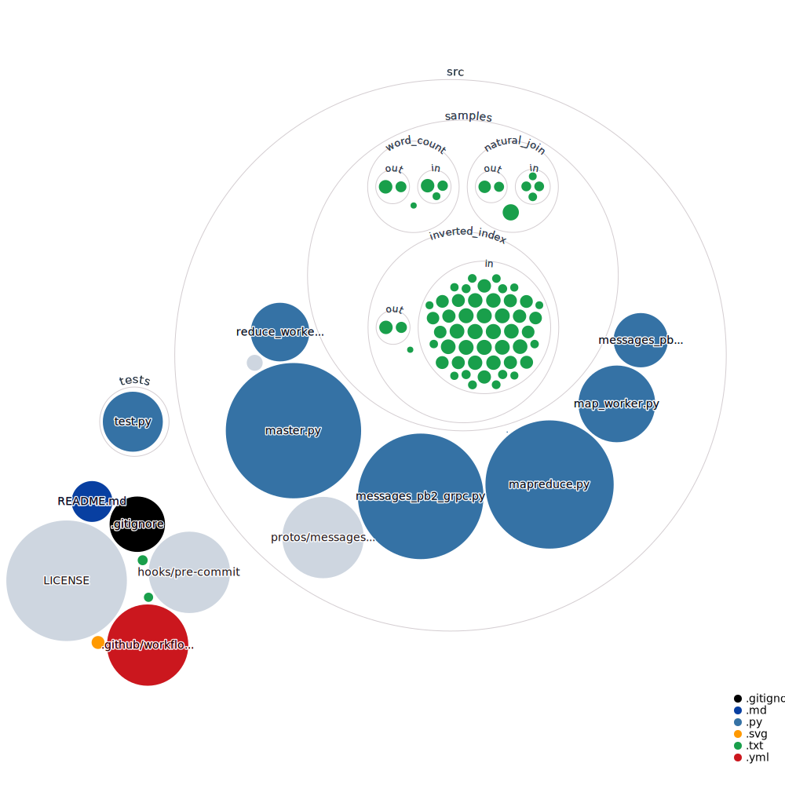

# DSCD Project Repository
In this repository you will find the code and data for the DSCD project. The project is a collaboration between the Fatui Harbingers and the Archons. The topic of the project is implementing Map-Reduce in python from scratch. ... That's... not a ... real project lol.

# Installation
Create an env (or not). Then run `pip install -r requirements.txt` to install the dependencies.  
If you're a developer, run `pip install -r requirements-dev.txt` to install the dev dependencies. Also run `git config core.hooksPath ".\hooks\`.

# Running
```py
python .\master.py --input samples/word_count/in --output lol --config samples/word_count/config.txt
```
or
```py
python .\master.py --input samples/word_count/in --output ../reduce_intermediate --n_map 2 --n_reduce 10        
```

# Testing
To test the project, run `python -m unittest` in the root directory. This will run all the tests in the `tests` directory.

# Structure of the Repository

